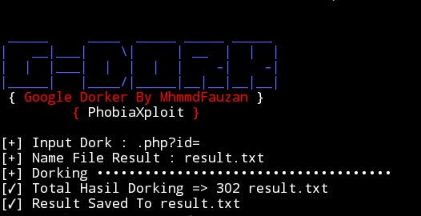

# Gdork
Simple Google Dorker


## Screenshot


### How To Use?
```
user@hist:~$ git clone http://github.com/PhobiaXploit/Gdork
user@host:~$ cd Gdork
user@host:~/Gdork$ chmod +x *
user@host:~/Gdork$ ./gdork.sh
```

## Example
 _____     ____  _____ _____ _____
|   __|___|    \|     | __  |  |  |                                     |  |  |___|  |  |  |  |    -|    -|
|_____|   |____/|_____|__|__|__|__|
{ Google Dorker By MhmmdFauzan }
         { PhobiaXploit }

[+] Input Dork : .php?id=

## Just Enter The Dork, Not Use inurl, intitle, intext
